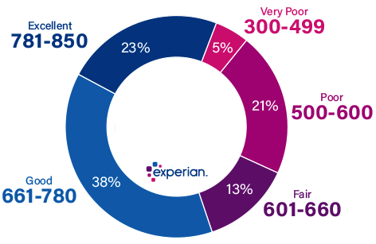
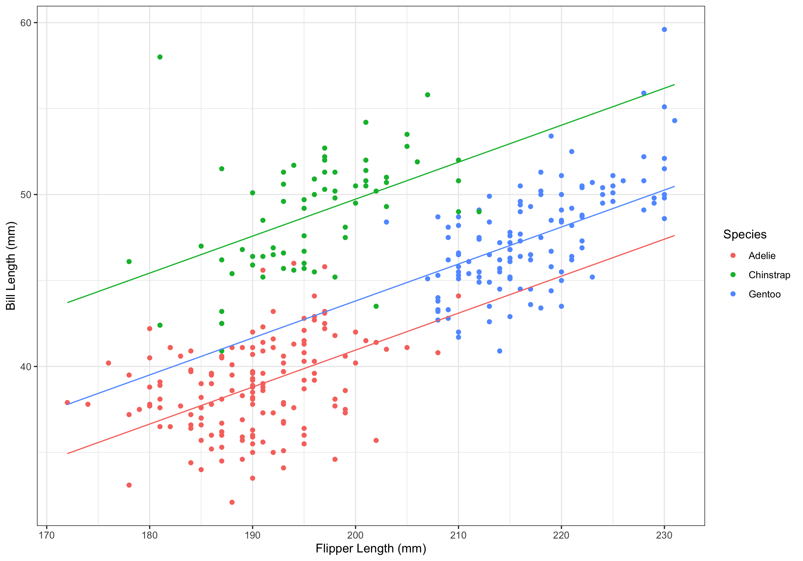

```{r setup, include=FALSE}
knitr::opts_chunk$set(echo = TRUE, warning = FALSE, message = FALSE, fig.path = "figure/listings-")
library(tidyverse)
library(palmerpenguins)
library(fastDummies)
```

## {.standout} 
\vskip12em
\begin{center}{\color{white} \huge \textbf{Categorical Predictors}} \vskip1em
{\color{white} \Large Statistics for Data Science II}
\end{center}

## Introduction

Recall the general linear model,
\[ y = \beta_0 + \beta_1 x_1 + \hdots + \beta_k x_k \]

Until now, we have discussed \textit{continuous} predictors. \vskip1em

Now, let us discuss including \textit{categorical}, or qualitative, predictors. \vskip1em

This means that we will include predictors that \textit{categorize} the observations.
\begin{itemize}
    \item We can assign numbers to the categories, however, the numbers are \textit{nominal}.
\end{itemize}

## Introduction

Let us consider the categorization of credit scores by Experian [\href{https://www.experian.com/blogs/ask-experian/credit-education/score-basics/what-is-a-good-credit-score/}{1}].

```{r, echo = FALSE, fig.align="center", out.width = "30%", fig.alt = "Credit ratings breakdown from Experian. Very Poor: 300-499, Poor: 500-600, Fair: 601-660, Good: 661-780, Excellent: 781-850"}

```

If this were a predictor in our model, there would be 5 categories:
\begin{itemize}
    \item Very Poor, Poor, Fair, Good, Excellent
\end{itemize}

## Introduction
\vskip1em

If there are $c$ classes in a categorical predictor, we include $c-1$ in the model. 
\begin{itemize}
    \item In the credit score example, there are $c=5$ categories. 
    \item Thus, we would include $c-1 = 4$ predictors in the model.
\end{itemize} \vskip.5em

\href{https://stats.idre.ucla.edu/other/mult-pkg/faq/general/faqwhat-is-dummy-coding/}{Dummy coding}:
\begin{itemize}
    \item The $c-1$ predictors included in the model will be binary indicators for category.
    \[ x_i = \begin{cases} 
      1 & \textnormal{if category $i$} \\
      0 & \textnormal{if another category}
   \end{cases}
   \]
\end{itemize} \vskip.5em

Note that there are other types of coding, including \href{https://stats.idre.ucla.edu/other/mult-pkg/faq/general/faqwhat-is-effect-coding/}{effect coding}.

## Creating Dummy Variables

\vskip1em
Continuing the credit score example, we would define the following indicators:
\[ x_{\textnormal{VP}} = \begin{cases} 
      1 & \textnormal{if credit = ``Very Poor''} \\
      0 & \textnormal{otherwise}
   \end{cases}
   \ \ \ \ x_{\textnormal{P}} = \begin{cases} 
      1 & \textnormal{if credit = ``Poor''} \\
      0 & \textnormal{otherwise}
   \end{cases} \]
\[ \ \ x_{\textnormal{F}} = \begin{cases} 
      1 & \textnormal{if credit = ``Fair''} \\
      0 & \textnormal{otherwise}
   \end{cases} \  \ \ \ \ \ \ \ \ \ \  x_{\textnormal{G}} = \begin{cases} 
      1 & \textnormal{if credit = ``Good''} \\
      0 & \textnormal{otherwise}
   \end{cases} \] 
   
\[ x_{\textnormal{E}} = \begin{cases} 
      1 & \textnormal{if credit = ``Excellent''} \\
      0 & \textnormal{otherwise}
   \end{cases} \ \ \ \ \ \ \ \ \ \ \ \ \ \ \ \ \ \ \ \  \ \ \ \ \ \ \ \  \ \ \ \ \ \ \ \ \ \  \ \ \  \]   
 
\vskip1em
This can be done through the \href{https://github.com/jacobkap/fastDummies}{\texttt{fastDummies}} package in R.

## Creating Dummy Variables

\textbf{Example}
\begin{itemize}
    \item Consider the data from the \href{https://allisonhorst.github.io/palmerpenguins/}{\texttt{palmerpenguin}} package. Let's create a dataset with the variables \texttt{species}, \texttt{bill\_length\_mm}, and \texttt{flipper\_length\_mm}.
\end{itemize} \vskip.5em

```{r}
data <- as_tibble(penguins %>% select(species,
                                      bill_length_mm,
                                      flipper_length_mm))
```

\begin{itemize}
  \item This code creates a tibble from the \texttt{penguins} dataset that contains only the columns \texttt{species}, \texttt{bill\_length\_mm}, and \texttt{flipper\_length\_mm}.
  \end{itemize}

## Creating Dummy Variables

\textbf{Example (Continued)}
\begin{itemize}
  \item If we examine the first few observations of the tibble,
\end{itemize}

```{r, echo = FALSE}
print(data, n = 5)
```

## Creating Dummy Variables

\textbf{Example (Continued)}

\begin{itemize}
  \item How many species are contained in the dataset?
\end{itemize} \vskip.5em

```{r}
data %>% count(species)
```

## Creating Dummy Variables

\textbf{Example (Continued)}

\begin{itemize}
  \item We now use the \texttt{dummy\_cols()} function in the \texttt{fastDummies} package to create our dummy variables
\end{itemize} \vskip.5em

```{r}
data <- dummy_cols(data, select_columns = "species")

colnames(data)
```

## Modeling 

We represent a categorical variable with $c$ classes with $c-1$ dummy variables in a model. 

The last dummy variable not included is called the \textit{reference group}. 

How do we choose a reference group?
\begin{itemize}
  \item It depends on the story being told / what is of interest.
  \item It does not affect the usefulness of the model, only the interpretations.
\end{itemize}


## Modeling

\textbf{Example}
\begin{itemize}
    \item In the penguin data, suppose we want to model bill length as a function of flipper length and species. Let us use Adelies as the reference group.
\end{itemize} \vskip.5em

\small
```{r}
m1 <- lm(bill_length_mm ~ flipper_length_mm + species_Chinstrap + 
         species_Gentoo, data = data)

coefficients(m1)
```

## Modeling

\textbf{Example}
\begin{itemize}
    \item What if we use Chinstraps as the reference group?
\end{itemize} \vskip.5em

\small
```{r}
m2 <- lm(bill_length_mm ~ flipper_length_mm + species_Adelie + 
         species_Gentoo, data = data)

coefficients(m2)
```

## Modeling

\textbf{Example}:
\begin{itemize}
  \item Looking at these models side by side,
\end{itemize} \vskip.5em

\small
```{r}
coefficients(m1)
coefficients(m2)
```

## Interpretations

As stated before, the dummy variable not included is the \textit{reference group}.
\begin{itemize}
    \item $\hat{\beta}_i$ is the difference between group $i$ and the reference group, after adjusting for all other terms in the model.
\end{itemize} 

The $y$-intercept of a model is the average outcome when all predictors are equal to 0.
\begin{itemize}
    \item Thus, the $y$-intercept is the average of the reference group, when all terms in the model are 0.
\end{itemize}

## Interpretations

\textbf{Example}:
\begin{itemize}
  \item Recall the model created with the penguin data,
\end{itemize} \vskip-1em
\[ \hat{y} =  -2.06 + 0.22x_{\textnormal{flipper}} + 8.78x_{\textnormal{Chinstrap}} + 2.86x_{\textnormal{Gentoo}} \]

\begin{itemize}
  \item For a 1 mm increase in flipper length, bill length increases by 0.22 mm.
  \item Chinstraps, on average, have bills 8.78 mm longer than Adelies.
  \item Gentoos, on average, have bills 2.86 mm longer than Adelies.
  \item When flipper length is 0 mm, Adelies have an average bill length of -2.06 mm.
\end{itemize}

## Testing for Significance

Recall that we can test the significance of a predictor using the $t$ test that is output by the \texttt{summary()} function.

Before we can talk about the individual $t$ tests for categorical predictors, we must learn about the "global" test for significance.

We will use ANOVA to determine if there is overall significance of the categorical predictor and we will use the $t$ test as a posthoc test.
\begin{itemize}
  \item i.e., ANOVA: $\beta_{c_1} = \beta_{c_2} = \hdots = 0$ and $t$-test: $\beta_{c_i} = \mu_{c_i} - \mu_{c_{\textnormal{ref}}} = 0$.
\end{itemize}

## Testing for Significance

To perform the global test for significance, we will construct two models:
\begin{itemize}
  \item M1 (full): model including the categorical predictor
  \item M2 (reduced): model without the categorical predictor
\end{itemize}

\textbf{Example}: \vskip.5em
```{r}
full <- lm(bill_length_mm ~ flipper_length_mm + species_Chinstrap + 
         species_Gentoo, data = data)

reduced <- lm(bill_length_mm ~ flipper_length_mm, data = data)
```

## Testing for Significance

Then, we will use the \texttt{anova()} function to compare the two models. \vskip1em

\textbf{Example}: \vskip.5em
\scriptsize
```{r}
anova(reduced, full)
```

## Testing for Significance

\vskip1em
Hypotheses
\begin{itemize}
  \item $H_0: \ \beta_{\textnormal{Chinstrap}} = \beta_{\textnormal{Gentoo}} = 0$
  \item $H_1:$ at least one $\beta_{i} \ne 0$, $i$ = \{Chinstrap, Gentoo\}
\end{itemize}

Test Statistic and $p$-Value
\begin{itemize}
  \item $F_{0} = 260.32$ ($p < 0.001$)
\end{itemize}

Rejection Region
\begin{itemize}
  \item Reject $H_0$ if $p < \alpha$; $\alpha=0.05$.
\end{itemize}

Conclusion / Interpretation
\begin{itemize}
  \item Reject $H_0$. Species is a significant predictor of bill length.
\end{itemize}

## Testing for Significance

If ANOVA does not show significance: \textbf{do not} look at $t$ tests for pairwise comparisons.

If ANOVA shows significance: \textbf{can} look at $t$ tests for pairwise comparisons.

Note that this puts us back in the world of multiple testing.
\begin{itemize}
  \item Recall that we should adjust to avoid inflation of the type I error ($\alpha$).
\end{itemize}

Bonferroni correction:
\[ \alpha_{\textnormal{B}} = \frac{\alpha}{k} \]
\begin{itemize}
  \item where $k$ is the number of tests being performed
\end{itemize}

## Testing for Significance

\textbf{Example}:
\begin{itemize}
  \item If we want to look at only two comparisons, we will use $\alpha_{\textnormal{B}} = 0.05/2 = 0.025$.
  \item If we want to look at all three comparisons, we will use $\alpha_{\textnormal{B}} = 0.05/3 = 0.017$.
\end{itemize} \vskip.5em

```{r}
summary(m1)[[4]]
```

## Testing for Significance

\textbf{Example}: \vskip1em
\tiny
```{r}
summary(m1)[[4]]
```
 \vskip1em
```{r}
summary(m2)[[4]]
```

## Confidence Intervals

Like in the $t$ test, the confidence intervals for $\beta_{c_i}$ for categorical predictors correspond to confidence intervals for $\mu_{c_i} - \mu_{c_{\textnormal{ref}}}$. \vskip1em

We can request confidence intervals from the \texttt{confint()} function. \vskip1em

Note that by default, \texttt{confint()} returns the 95% confidence interval.
\begin{itemize}
  \item We can change this using the \texttt{level} option.
  \item e.g., \texttt{confint(m1, level = 0.72)}
\end{itemize}

## Confidence Intervals

\textbf{Example}:
\begin{itemize}
  \item Looking at confidence intervals for the penguin data,
\end{itemize} \vskip.5em 

```{r}
confint(m1)
```

## Confidence Intervals

\textbf{Example}: \vskip.5em

\scriptsize
```{r}
confint(m1)
```
\vskip1em
```{r}
confint(m2)
```

## Visualizing the Model

Including categorical predictors in the model varies the $y$-intercept. 

\textbf{Example}: \vskip.5em
\small
```{r}
coefficients(m1)
```
\normalsize
\[ \hat{y}_{\textnormal{Chinstraps}} = 6.72 + 0.22 x_{\textnormal{flipper}} \]
\[ \ \ \hat{y}_{\textnormal{Gentoos}} = 0.80 + 0.22 x_{\textnormal{flipper}} \]
\[ \ \ \ \ \ \ \hat{y}_{\textnormal{Adelies}} = -2.06 + 0.22 x_{\textnormal{flipper}} \]

## Visualizing the Model

This also means that we can plot the separate regression lines on a graph.

\textbf{Example}:
\begin{itemize}
  \item We use the coefficients to create the predicted value, $\hat{y}$, 
\end{itemize}

\small
```{r}
c1 <- coefficients(m1)
```

```{r, echo = FALSE}
coefficients(m1)
```

```{r}
data <- data %>% mutate(
          predAdelie = c1[[1]] + c1[[2]]*flipper_length_mm,
          predChinstrap = c1[[1]] + c1[[2]]*data$flipper_length_mm + c1[[3]],
          predGentoo = c1[[1]] + c1[[2]]*data$flipper_length_mm + c1[[4]]
        )
```

## Visualizing the Model

\textbf{Example}:
\begin{itemize}
  \item The following code will create the graph with the different regression lines:
\end{itemize} \vskip.5em

\small
```{r, echo = FALSE}
data <- data %>% rename(Species = species)
```

```{r}
p <- ggplot(data, aes(x=flipper_length_mm, y=bill_length_mm, color=Species)) +
  geom_point() +
  geom_line(aes(y = predAdelie), color = "#F8766D", linetype = "solid") +
  geom_line(aes(y = predChinstrap), color = "#00BA38", linetype = "solid") +
  geom_line(aes(y = predGentoo), color = "#619CFF", linetype = "solid") +
  xlab("Flipper Length (mm)") +
  ylab("Bill Length (mm)") +
  theme_bw() 
```

```{r, echo = FALSE}
ggsave("/Volumes/GoogleDrive/My Drive/IAIA - SDSII/SDSII/lectures/images/w1l2fig2.png")
```


## Visualizing the Model 

\textbf{Example}:

```{r, echo = FALSE, out.width = "60%", fig.align="center", fig.alt = "Scatterplot with regression lines overlaid; flipper length (mm) is on the x-axis while bill length (mm) is on the y axis; regression lines are defined by species. Pink dots represent Adelie penguins, green dots represent Chinstrap penguins, and blue dots represent Gentoo penguins. The pink line is the regression line for Adelies, the green line is the regression line for Chinstraps, and the blue line is the regression line for Gentoos."}

```


## Future Considerations

As we increase the number of terms in our model, visualizations can quickly become more complicated.

If there are multiple continuous predictors:
\begin{itemize}
  \item We allow only one to vary on the $x$ axis. 
  \item We plug in specific values for the ones we are holding constant.
  \begin{itemize}
    \item e.g., the mean, median, or "known" value of interest
  \end{itemize}
\end{itemize}

## Future Considerations

As we increase the number of terms in our model, visualizations can quickly become more complicated.

If there are multiple categorical predictors:
\begin{itemize}
  \item We can create lines for every combination.
  \begin{itemize}
    \item e.g., male Adelies, female Adelies, male Chinstraps, etc.
  \end{itemize}
  \item We can hold some constant and create lines for the others.
  \begin{itemize}
    \item e.g., the graph itself is for males, then have lines for species.
  \end{itemize}
\end{itemize}

## Future Considerations

What if there are a ton of categories?
\begin{itemize}
  \item e.g., state
\end{itemize}

We need to make sure there are enough observations in each category to warrant inclusion in the model.

If not enough observations, we can condense categories.
\begin{itemize}
  \item e.g., Likert scale: combine "agree" and "strongly agree"
\end{itemize}

We also need to keep interpretability/generalizability in mind.