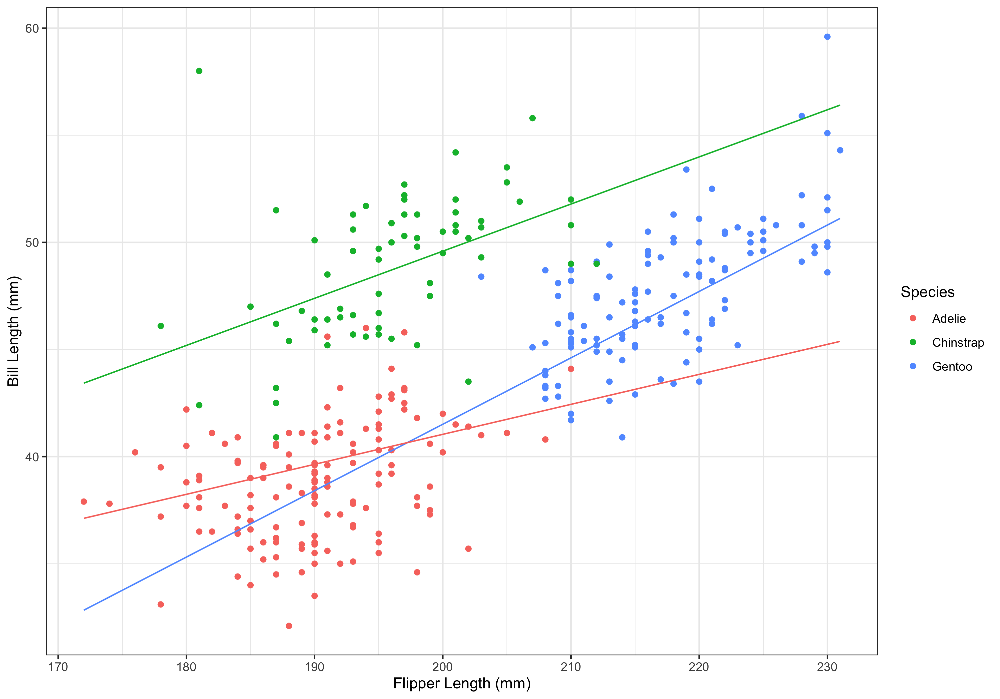
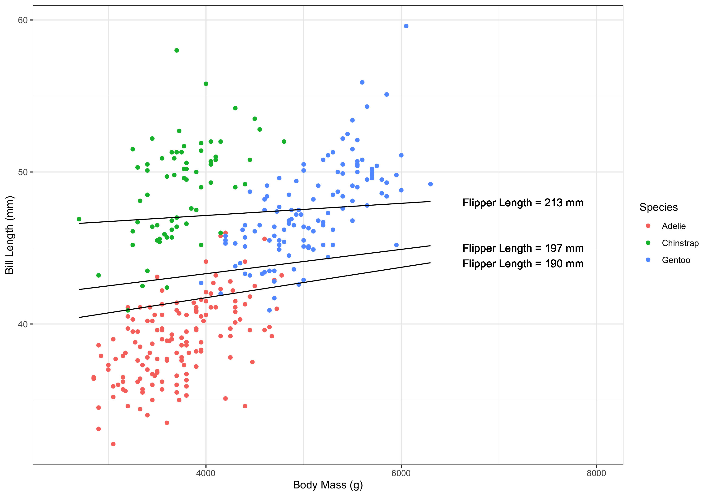
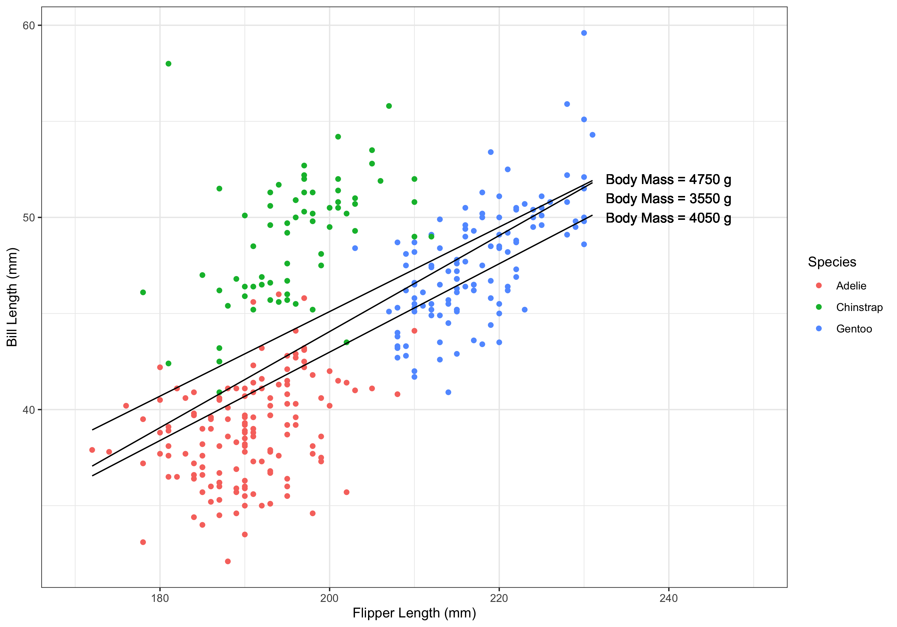

```{r setup, include=FALSE}
knitr::opts_chunk$set(echo = TRUE, warning = FALSE, message = FALSE, fig.path = "images")

library(tidyverse)
library(palmerpenguins)
library(fastDummies)

options(scipen = 1, digits = 4)

data <- as_tibble(na.omit((penguins %>% select(species,
                                      bill_length_mm,
                                      flipper_length_mm,
                                      body_mass_g,
                                      sex))))

data <- dummy_cols(data, select_columns = c("sex", "species"))
```

## {.standout} 
\vskip12em
\begin{center}{\color{white} \huge \textbf{Interaction Terms in Regression Models}} \vskip1em
{\color{white} \Large Statistics for Data Science II}
\end{center}

## Introduction

\vskip1em
Recall interactions from two-way ANOVA:
\begin{itemize}
  \item The relationship between the outcome and one predictor depends on the level of another predictor.
\end{itemize}

Interactions work (and are specified) the same way in regression. 

The usual caveats apply:
\begin{itemize}
  \item We do not want to load models with too many interactions.
  \item We favor simplicity over interactions that do not add much to the predictive power of the model.
  \item We do not want higher than two-way interactions unless necessary.
\end{itemize}

## Types of Interactions

The easiest interactions to deal with are categorical $\times$ continuous interactions.
\begin{itemize}
  \item The continuous predictor automatically is assigned to the $x$-axis when graphing.
\end{itemize}

We can also deal with categorical $\times$ categorical interactions.
\begin{itemize}
  \item If one categorical variable is ordinal, that should be assigned to the $x$-axis when graphing.
\end{itemize}

Finally, we can also have categorical $\times$ categorical interactions.
\begin{itemize}
  \item This can be tricky because we do not have easily-defined levels. Either can be assigned to the $x$-axis when graphing.
\end{itemize}

## Modeling

\vskip1em
We will construct what is called a hierarchical well-formulated (HWF) model. 

This means that when a higher-order interaction term is included in the model, all lower-order terms are also included.

e.g., when a two-way interaction is included, we also include the corresponding main effects.
\[ y = \beta_0 + \beta_1 x_1 + \beta_2 x_2 + \beta_3 x_1 x_2 \]

e.g., when a three-way interaction is included, we also include the corresponding main effects and two-way interactions.
\[ y = \beta_0 + \beta_1 x_1 + \beta_2 x_2 + \beta_3 x_3 + \beta_4 x_1 x_2 + \beta_5 x_1 x_3 + \beta_6 x_2 x_3 + \beta_7 x_1 x_2 x_3 \]

## Modeling

\textbf{Example:}
\begin{itemize}
  \item Recall the data from the \href{https://allisonhorst.github.io/palmerpenguins/}{\texttt{palmerpenguin}} package.   \vskip1em
  \item Let us now consider the following interactions: 
    \begin{itemize}
      \item flipper length and species
      \item species and sex
      \item flipper length and body mass
    \end{itemize} \vskip1em
  \item For simplicity / example's purpose, let us consider them one at a time.
\end{itemize}

## Modeling: Continuous $\times$ Categorical

\vskip1em

\textbf{Example:}
\begin{itemize}
  \item First, let's look at the interaction between flipper length (continuous) and species (categorical).
\end{itemize} \vskip.5em

\scriptsize 
```{r}
m1 <- lm(bill_length_mm ~ flipper_length_mm + species_Chinstrap + 
           species_Gentoo + species_Chinstrap:flipper_length_mm +
           species_Gentoo:flipper_length_mm, data = data)

coefficients(m1)
```

```{r, echo = FALSE}
c1 <- coefficients(m1)
```

## Modeling: Continuous $\times$ Categorical

\textbf{Example:}
\begin{itemize}
  \item The model is 
\end{itemize}
\footnotesize 
$\hat{y} = `r round(c1[1],2)` + `r round(c1[2], 2)` \text{flipper}  `r round(c1[3], 2)` \text{Chinstrap} `r round(c1[4], 2)` \text{Gentoo}  + `r round(c1[5], 2)` (\text{flipper} \times \text{Chinstrap}) + `r round(c1[6], 2)` (\text{flipper} \times \text{Gentoo})$

\normalsize 
\begin{itemize}
  \item We can separate this into different models for species:
\end{itemize}

```{r, echo = FALSE}
# generic model:
# c1[[1]] + c1[[2]]*flipper + c1[[3]]*chinstrap + c1[[4]]*gentoo + c1[[5]]*chinstrap*flipper + c1[[6]]*gentoo*flipper

# chinstraps
# c1[[1]] + c1[[2]]*flipper + c1[[3]]*1 + c1[[5]]*1*flipper 
# intercept: c1[[1]] + c1[[3]]*1 = 5.59
# slope for flipper: c1[[2]] + c1[[5]] = 0.22
  
# gentoo
# c1[[1]] + c1[[2]]*flipper + c1[[4]]*1 + c1[[6]]*1*flipper
# intercept: c1[[1]] +  c1[[4]]*1 = -20.49
# slope for flipper: c1[[2]] + c1[[6]] = 0.31

# adelie
# c1[[1]] + c1[[2]]*flipper 
# intercept: c1[[1]] = 13.04
# slope for flipper: c1[[2]] = 0.14
```

\vskip-2em

\begin{align*}
  \text{Chinstraps (Chinstrap = 1, Gentoo = 0)}: & \ \hat{y} = 5.59 + 0.22 \text{flipper} \\
  \text{Gentoos (Chinstrap = 0, Gentoo = 1)}: & \ \hat{y} = -20.49 + 0.31 \text{flipper} \\
  \text{Adelies (Chinstrap = 0, Gentoo = 0)}: & \  \hat{y} = 13.04 + 0.14 \text{flipper}
\end{align*}

## Modeling: Continuous $\times$ Categorical

\textbf{Example:}
\begin{itemize}
  \item We can see that the slope describing the relationship between bill length and flipper length depend on the species of penguin:
    \begin{itemize}
      \item Adelie: 0.14 $\times$ flipper 
      \item Chinstrap: 0.22 $\times$ flipper
      \item Gentoo: 0.31 $\times$ flipper
    \end{itemize} \vskip1em
  \item Thus, Adelies have the smallest slope of the three species, while Gentoos have the steepest slope of the three species.
\end{itemize}

## Modeling: Categorical $\times$ Categorical

\textbf{Example:}
\begin{itemize}
  \item Let us now look at the interaction between species and sex.
\end{itemize} \vskip.5em

\scriptsize 
```{r}
m2 <- lm(bill_length_mm ~ sex_male + species_Chinstrap +  species_Gentoo + 
         species_Chinstrap:sex_male + species_Gentoo:sex_male, data = data)

coefficients(m2)
```

```{r, echo = FALSE}
c2 <- coefficients(m2)
```

## Modeling: Categorical $\times$ Categorical

\vskip1em
\textbf{Example:}
\begin{itemize}
  \item The model is 
\end{itemize}
\footnotesize 
$\hat{y} = `r round(c2[1], 2)` + `r round(c2[2], 2)` \text{male} + `r round(c2[3], 2)` \text{Chinstrap} + `r round(c2[4], 2)` \text{Gentoo} + `r round(c2[5], 2)` \text{male $\times$ Chinstrap} + `r round(c2[6], 2)` \text{male $\times$ Gentoo}$

```{r, echo = FALSE}
c2 <- coefficients(m2)

# generic model:
# c2[[1]] + c2[[2]]*male + c2[[3]]*chinstrap + c2[[4]]*gentoo + c2[[5]]*male*Chinstrap + c2[[6]]*male*Gentoo

# chinstraps
# c2[[1]] + c2[[2]]*male + c2[[3]]*1 + c2[[5]]*male*1
# intercept: c2[[1]] + c2[[3]]*1 = 46.57
# slope for male: c2[[2]] + c2[[5]] = 4.52
  
# gentoo
# c2[[1]] + c2[[2]]*male + c2[[4]]*1 + c2[[6]]*male*1
# intercept: c2[[1]] +  c2[[4]]*1 = 45.56
# slope for male: c2[[2]] + c2[[6]] = 3.91

# adelie
# c2[[1]] + c2[[2]]*male 
# intercept: c2[[1]] = 37.26
# slope for male: c2[[2]] = 3.13
```

\normalsize 
\begin{itemize}
  \item We can separate this into different models for species:
\end{itemize} \vskip-2em

\begin{align*}
  \text{Chinstrap (Chinstrap = 1, Gentoo = 0)}: & \ \hat{y} = 46.57 + 4.52 \text{male} \\
  \text{Gentoos (Chinstrap = 0, Gentoo = 1)}: & \ \hat{y} = 45.56 + 3.91 \text{male} \\
  \text{Adelies (Chinstrap = 0, Gentoo = 0)}: & \  \hat{y} = 37.26 + 3.13 \text{male}
\end{align*}

\begin{itemize}
  \item Males, on average, have larger bill sizes than females. The difference is largest in Chinstraps and smallest in Adelies.
\end{itemize}

## Modeling: Categorical $\times$ Categorical

\textbf{Example:}
\begin{itemize}
  \item The model is 
\end{itemize}
\footnotesize 
$\hat{y} = `r round(c2[1], 2)` + `r round(c2[2], 2)` \text{male} + `r round(c2[3], 2)` \text{Chinstrap} + `r round(c2[4], 2)` \text{Gentoo} + `r round(c2[5], 2)` \text{male $\times$ Chinstrap} + `r round(c2[6], 2)` \text{male $\times$ Gentoo}$

```{r, echo = FALSE}
c2 <- coefficients(m2)

# generic model:
# c2[[1]] + c2[[2]]*male + c2[[3]]*chinstrap + c2[[4]]*gentoo + c2[[5]]*male*Chinstrap + c2[[6]]*male*Gentoo

# males
# c2[[1]] + c2[[2]]*1 + c2[[3]]*chinstrap + c2[[4]]*gentoo + c2[[5]]*1*Chinstrap + c2[[6]]*1*Gentoo
# intercept: c2[[1]] + c2[[2]]*1 = 40.39
# slope for Chinstrap: c2[[3]] + c2[[5]] = 10.70
# slope for Gentoo: c2[[4]] + c2[[6]] = 9.08
  
# females
# # c2[[1]] + c2[[3]]*chinstrap + c2[[4]]*gentoo 
# intercept: c2[[1]] = 37.26
# slope for Chinstrap: c2[[3]]  = 9.32
# slope for Gentoo: c2[[4]] = 8.31
```

\normalsize 
\begin{itemize}
  \item We can also separate this into different models for sex:
\end{itemize} \vskip-2em

\begin{align*}
  \text{Males (male = 1)}: & \ \hat{y} = 40.39 + 10.70 \text{Chinstrap} + 9.08 \text{Gentoo} \\
  \text{Females (male = 0)}: & \ \hat{y} =  37.26 + 9.32 \text{Chinstrap} + 8.31 \text{Gentoo}
\end{align*}

\begin{itemize}
  \item Chinstraps and Gentoos both have longer bill lengths than Adelies; we can also see that males have longer bill lengths than females.
\end{itemize}

## Modeling: Continuous $\times$ Continuous

\textbf{Example:}
\begin{itemize}
  \item Finally, let's look at the interaction between flipper length and body mass.
\end{itemize} \vskip.5em

\scriptsize 
```{r}
m3 <- lm(bill_length_mm ~ flipper_length_mm + body_mass_g + flipper_length_mm:body_mass_g, 
         data = data)

coefficients(m3)
```

```{r, echo = FALSE}
c3 <- coefficients(m3)
```

## Modeling: Continuous $\times$ Continuous

\textbf{Example:}
\begin{itemize}
  \item The model is 
\end{itemize} \vskip-1em
\footnotesize 
\[\hat{y} = `r round(c3[1], 2)` + `r round(c3[2], 2)` \text{flipper} + `r round(c3[3], 2)` \text{body mass} - 0.00003 \text{(flipper $\times$ body mass)}\]
\normalsize 
\begin{itemize}
  \item Both flipper length and body mass have positive relationships with bill length, however, as the other variable increases, the slope decreases. 
  \begin{itemize}
    \item As body mass increases, bill length increases. However, as flipper length increases, the slope for body mass decreases slightly.
    \item As flipper length increases, bill length increases. However, as body mass increases, the slope for flipper length decreases slightly.
  \end{itemize}
\end{itemize}

## Modeling: Continuous $\times$ Continuous

\textbf{Example:}
\begin{itemize}
  \item If we are interested, we can plug in values (my choices: 25th percentile, median, 75th percentile) for either continuous predictor to construct models as we did for categorical variables.
\end{itemize}

```{r, echo = FALSE}
c3 <- coefficients(m3)

# generic model:
# c3[[1]] + c3[[2]]*flipper + c3[[3]]*body + c3[[4]]*body*flipper 

# quantile(data$flipper_length_mm, 0.25, na.rm = TRUE) = 190
# median(data$flipper_length_mm, na.rm = TRUE) = 197
# quantile(data$flipper_length_mm, 0.75, na.rm = TRUE) = 213

#25th percentile
# c3[[1]] + c3[[2]]*190 + c3[[3]]*body + c3[[4]]*body*190
# intercept: c3[[1]] + c3[[2]]*190 = 37.73
# slope for body: c3[[3]] + c3[[4]]*190 = 0.001

# median
# c3[[1]] + c3[[2]]*197 + c3[[3]]*body + c3[[4]]*body*197
# intercept: c3[[1]] + c3[[2]]*197 = 40.11
# slope for body: c3[[3]] + c3[[4]]*197 = 0.0008

# 75th percentile
# c3[[1]] + c3[[2]]*213 + c3[[3]]*body + c3[[4]]*body*213
# intercept: c3[[1]] + c3[[2]]*213 = 45.54
# slope for body: c3[[3]] + c3[[4]]*213 = 0.0004
```

\begin{itemize}
  \item For flipper size,
\end{itemize} \vskip-2em

\begin{align*}
  \text{25th percentile (flipper = 190 mm)} :& \ \hat{y} = 37.73 + 0.001 \text{body} \\
  \text{median (flipper = 197 mm)} :& \ \hat{y} = 40.11 + 0.0008 \text{body} \\
  \text{75th percentile (flipper = 213 mm)} :& \ \hat{y} = 45.54 + 0.0004 \text{body}
\end{align*}

## Modeling: Continuous $\times$ Continuous

\vskip1em
\textbf{Example:}
\begin{itemize}
  \item If we are interested, we can plug in values (my choices: 25th percentile, median, 75th percentile) for either continuous predictor to construct models as we did for categorical variables.
\end{itemize}

```{r, echo = FALSE}
c3 <- coefficients(m3)

# generic model:
# c3[[1]] + c3[[2]]*flipper + c3[[3]]*body + c3[[4]]*body*flipper 

# quantile(data$body_mass_g, 0.25, na.rm = TRUE) = 3550
# median(data$body_mass_g, na.rm = TRUE) = 4050
# quantile(data$body_mass_g, 0.75, na.rm = TRUE) = 4750

#25th percentile
# c3[[1]] + c3[[2]]*flipper + c3[[3]]*3550 + c3[[4]]*3550*flipper
# intercept: c3[[1]] + c3[[3]]*3550 = -5.936
# slope for flipper: c3[[2]] + c3[[4]]*3550 = 0.25

# median
# c3[[1]] + c3[[2]]*flipper + c3[[3]]*4050 + c3[[4]]*4050*flipper
# intercept: c3[[1]] + c3[[3]]*4050 = -3.01
# slope for flipper: c3[[2]] + c3[[4]]*4050 = 0.23

# 75th percentile
# c3[[1]] + c3[[2]]*flipper + c3[[3]]*4750 + c3[[4]]*4750*flipper
# intercept: c3[[1]] + c3[[3]]*4750 = 1.10
# slope for flipper: c3[[2]] + c3[[4]]*4750 = 0.22
```

\begin{itemize}
  \item For body mass,
\end{itemize} \vskip-2em

\begin{align*}
  \text{25th percentile (body mass = 3550 g)} :& \ \hat{y} = -5.94 + 0.25 \text{flipper} \\
  \text{median (body mass = 4050 g)} :& \ \hat{y} = -3.01 + 0.24 \text{flipper} \\
  \text{75th percentile (body mass = 4750 g)} :& \ \hat{y} = 1.10 + 0.22 \text{flipper}
\end{align*}

## Testing

Largely, testing works the same way as we've tested predictors before. 

If we have a categorical variable with more than 2 levels in an interaction term, we must use a multiple partial $F$ test to determine if the interaction is significant. 

Otherwise, we will use the $t$-test output from the \texttt{summary()} function to determine if interactions are significant.

## Testing

\vskip1em
\textbf{Example:}
\begin{itemize}
  \item Let's go back to our first model: bill length as a function of flipper length, species, and the interaction between flipper length and species.
\end{itemize} \vskip.5em

\scriptsize
```{r}
summary(m1)[4]
```

\normalsize
\begin{itemize}
  \item We need to use a multiple partial $F$ to determine if the interaction is significant.
\end{itemize}

## Testing

\vskip1em
\textbf{Example:}
\vskip.5em

\tiny
```{r}
full <- lm(bill_length_mm ~ flipper_length_mm + species_Chinstrap +  species_Gentoo + species_Chinstrap:flipper_length_mm +
           species_Gentoo:flipper_length_mm, data = data)

reduced <- lm(bill_length_mm ~ flipper_length_mm + species_Chinstrap + species_Gentoo, data = data)

anova(reduced, full)
```

\normalsize
\begin{itemize}
  \item The interaction (overall) is significant ($p=0.001$). Now, we can look at the individual terms
\end{itemize}

## Testing

\vskip1em
\textbf{Example:}
\vskip.5em

\scriptsize
```{r}
summary(m1)[4]
```

\normalsize
\begin{itemize}
  \item Flipper length slopes are different between Gentoos and Adelies ($p<0.001$), but not Chinstraps and Adelies ($p=0.119$). 
\end{itemize}

## Testing

\vskip1em
\textbf{Example:}
\begin{itemize}
  \item Let's now look at the second model: bill length as a function of sex, species, and the interaction between sex and species.
\end{itemize} \vskip.5em

\scriptsize
```{r}
summary(m2)[4]
```

\normalsize
\begin{itemize}
  \item Again, we must use a multiple partial $F$ to determine if the interaction is significant.
\end{itemize}

## Testing

\vskip1em
\textbf{Example:}
\vskip.5em

\tiny
```{r}
full <- lm(bill_length_mm ~ sex_male + species_Chinstrap +  species_Gentoo + species_Chinstrap:sex_male +
           species_Gentoo:sex_male, data = data)

reduced <- lm(bill_length_mm ~ sex_male + species_Chinstrap + species_Gentoo, data = data)

anova(reduced, full)
```

\normalsize
\begin{itemize}
  \item The interaction (overall) is not significant ($p=0.100$). We have no reason to look at the individual terms.
\end{itemize}

## Testing

\vskip1em
\textbf{Example:}
\begin{itemize}
  \item Let's now look at the third model: bill length as a function of flipper length, body mass, and the interaction between flipper length and body mass.
\end{itemize} \vskip.5em

\scriptsize
```{r}
summary(m3)[4]
```

\normalsize
\begin{itemize}
  \item Because we have a continuous $\times$ continous interaction term, we do not need to use a multiple partial $F$ test -- we can just use the $t$-test above.
  \item The interaction between flipper length and body mass is not significant ($p=0.270$).
\end{itemize}

## Testing

Recall that we do not interpret main effects when interaction terms are included in the model.

In our first example, we would not be able to interpret main effects because the interaction term was significant.

In our second and third example, we would be able to interpret the main effects because the interaction terms were not significant.
\begin{itemize}
  \item Because we are interested in parsimony, we would remove the interaction term(s) from the models and obtain new estimates for the main effects.
\end{itemize}

## Visualization

Let us consider visualizing the models we have already constructed:
\begin{itemize}
  \item flipper length, species, interaction
  \begin{itemize}
    \item flipper length on $x$-axis, lines for species
  \end{itemize}
  \item sex, species, interaction
  \begin{itemize}
    \item neither of the predictors make sense on the $x$-axis
  \end{itemize}
  \item flipper length, body mass, interaction
  \begin{itemize}
    \item flipper length on $x$-axis, body mass held constant
    \item body mass on $x$-axis, flipper length held constant
  \end{itemize}
\end{itemize}

## Visualization

\vskip1em
\textbf{Example:} \vskip.5em

\begin{itemize}
  \item Let's build a visualization for the first model. This requires predicted values. 
  \item Flipper length is the only continuous variable, so it will be on the $x$-axis.
  \item We will plot a line for each of the species. This requires separate columns for prediction purposes.
\end{itemize} \vskip.5em

```{r}
data <- data %>% mutate(
          m1c = 5.59 + 0.22*data$flipper_length_mm,
          m1g = -20.49 + 0.31*data$flipper_length_mm,
          m1a = 13.04 + 0.14*data$flipper_length_mm
        )
```

## Visualization

\textbf{Example:} \vskip1em

\scriptsize
```{r}
p1 <- ggplot(data, aes(x=flipper_length_mm, y=bill_length_mm, color=species)) +
        geom_point() +
        geom_line(aes(y = m1c), color = "#00BA38", linetype = "solid") +
        geom_line(aes(y = m1g), color = "#619CFF", linetype = "solid") +
        geom_line(aes(y = m1a), color = "#F8766D", linetype = "solid") +
        xlab("Flipper Length (mm)") +
        ylab("Bill Length (mm)") +
        scale_color_discrete(name = "Species") +
        theme_bw() 
```

```{r, echo = FALSE}
ggsave("/Volumes/GoogleDrive/My Drive/IAIA/SDSII/lectures/images/w1l3fig1.png")
```

## Visualization

\vskip1em
\textbf{Example:} \vskip1em

```{r, echo = FALSE, fig.align="center", out.width = "60%", fig.alt = "Scatterplot with regression lines overlaid; flipper length (mm) is on the x-axis while bill length (mm) is on the y axis; regression lines are defined by species. Pink dots represent Adelie penguins, green dots represent Chinstrap penguins, and blue dots represent Gentoo penguins. The pink line is the regression line for Adelies, the green line is the regression line for Chinstraps, and the blue line is the regression line for Gentoos."}

```

## Visualization

\vskip1em
\textbf{Example:}
\begin{itemize}
  \item Let's now build a visualization for the third model.
  \item Flipper length and body mass are both continuous variables. For demonstration purposes we will build two visualizations: one with flipper length on the $x$-axis and another with body mass on the $x$-axis.
  \item We again need predicted values,
\end{itemize} \vskip.5em

\scriptsize
```{r}
data <- data %>% mutate(
          m3f25 = 37.73 + 0.001*body_mass_g,
          m3f50 = 40.11 + 0.0008*body_mass_g,
          m3f75 = 45.54 + 0.0004*body_mass_g,
          m3bm25 = -5.94 + 0.25*flipper_length_mm,
          m3bm50 = -3.01 + 0.23*flipper_length_mm,
          m3bm75 = 1.10 + 0.22*flipper_length_mm
        )
```

## Visualization

\textbf{Example:} \vskip1em

\tiny
```{r}
p2 <- ggplot(data, aes(x=body_mass_g, y=bill_length_mm, color=species)) +
        geom_point() +
        geom_line(aes(y = m3f25), color = "black", linetype = "solid") +
        geom_text(aes(x = 7250, y = 44, label = "Flipper Length = 190 mm"), color="black", show.legend = FALSE) + 
        geom_line(aes(y = m3f50), color = "black", linetype = "solid") +
        geom_text(aes(x = 7250, y = 45, label = "Flipper Length = 197 mm"), color="black", show.legend = FALSE) + 
        geom_line(aes(y = m3f75), color = "black", linetype = "solid") +
        geom_text(aes(x = 7250, y = 48, label = "Flipper Length = 213 mm"), color="black", show.legend = FALSE) + 
        xlab("Body Mass (g)") + xlim(2500,8000) +
        ylab("Bill Length (mm)") +
        scale_color_discrete(name = "Species") +
        theme_bw() 
```

```{r, echo = FALSE}
ggsave("/Volumes/GoogleDrive/My Drive/IAIA/SDSII/lectures/images/w1l3fig2.png")
```

## Visualization

\vskip1em
\textbf{Example:} \vskip1em

```{r, echo = FALSE, out.width = "60%", fig.align="center", fig.alt = "Scatterplot with regression lines overlaid; body mass (g) is on the x-axis while bill length (mm) is on the y axis; regression lines are defined by levels of flipper length. Pink dots represent Adelie penguins, green dots represent Chinstrap penguins, and blue dots represent Gentoo penguins. The top line is for flipper length of 213 mm, the middle line is for flipper length of 197 mm, and the bottom line is for flipper length of 190 mm."}

```

## Visualization

\textbf{Example:} \vskip1em

\tiny
```{r}
p3 <- ggplot(data, aes(x=flipper_length_mm, y=bill_length_mm, color=species)) +
        geom_point() +
        geom_line(aes(y = m3bm25), color = "black", linetype = "solid") +
        geom_text(aes(x = 240, y = 51, label = "Body Mass = 3550 g"), color="black", show.legend = FALSE) + 
        geom_line(aes(y = m3bm50), color = "black", linetype = "solid") +
        geom_text(aes(x = 240, y = 50, label = "Body Mass = 4050 g"), color="black", show.legend = FALSE) + 
        geom_line(aes(y = m3bm75), color = "black", linetype = "solid") +
        geom_text(aes(x = 240, y = 52, label = "Body Mass = 4750 g"), color="black", show.legend = FALSE) + 
        xlab("Flipper Length (mm)") + xlim(170, 250) +
        ylab("Bill Length (mm)") +
        scale_color_discrete(name = "Species") +
        theme_bw() 
```

```{r, echo = FALSE}
ggsave("/Volumes/GoogleDrive/My Drive/IAIA/SDSII/lectures/images/w1l3fig3.png")
```

## Visualization

\vskip1em
\textbf{Example:} \vskip1em

```{r, echo = FALSE, out.width = "60%", fig.align="center", fig.alt = "Scatterplot with regression lines overlaid; flipper length (mm) is on the x-axis while bill length (mm) is on the y axis; regression lines are defined by levels of body mass (g). Pink dots represent Adelie penguins, green dots represent Chinstrap penguins, and blue dots represent Gentoo penguins. The top line is for body mass of 4750 g, the middle line is for body mass of 3550 g, and the bottom line is for body mass of 4050 g."}

```

## Future Considerations

As was mentioned in the categorical predictor lecture, we examined simple examples here.

Modeling and visualizing becomes more difficult as we increase the number of predictors, especially with interaction terms.

It is easy to go down a rabbit hole with regard to visualization -- always communicate with your team to determine what will be \textit{useful}.